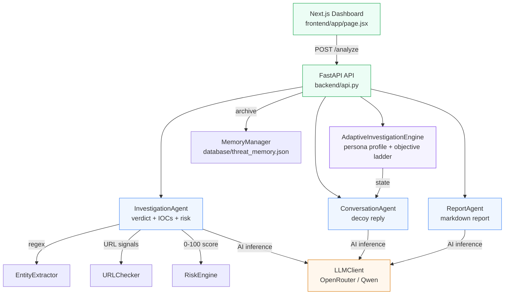
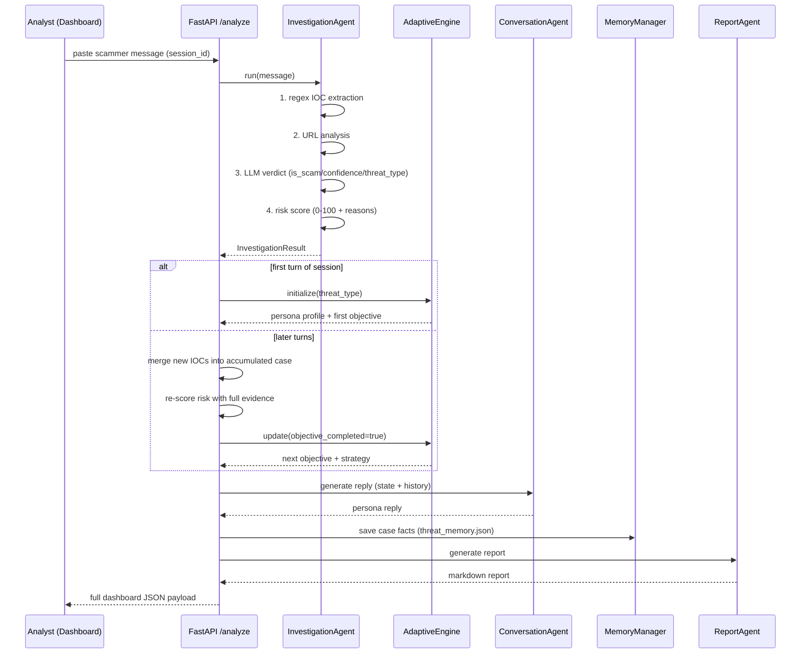

# 🛡️ TraceAI — Undercover Scam Investigation Dashboard

> **TraceAI** is a production-ready, AI-driven scam-investigation platform. It runs an **automated undercover agent** that talks to online scammers, extracts **Indicators of Compromise (IOCs)**, scores risk, and compiles detailed incident reports for security analysts.

---

## 📖 Table of Contents
- [What is TraceAI?](#-what-is-traceai)
- [Key Features](#-key-features)
- [Architecture](#-architecture)
- [How an Investigation Works (request flow)](#-how-an-investigation-works)
- [Repository Layout](#-repository-layout)
- [Technology Stack](#-technology-stack)
- [Environment Variables](#-environment-variables)
- [Getting Started](#-getting-started)
- [Running Unit Tests](#-running-unit-tests)
- [Production Deployment](#-production-deployment)
- [Limitations & Roadmap](#-limitations--roadmap)
- [Interactive Developer Guide](#-interactive-developer-guide)

---

## 🔍 What is TraceAI?

Investigating scams is hard because scammers vanish the moment they smell a trap. TraceAI puts an **AI-driven proxy in the communication path**:

1. An analyst pastes a scammer's real message (SMS / WhatsApp / email).
2. TraceAI classifies the threat and creates a **believable decoy victim persona** matched to the scam type (a worried SBI customer, a job-hunting graduate, a wealthy retiree…).
3. The persona then **chats with the scammer**, subtly steering the conversation to safely collect credentials, payment rails, and infrastructure details.
4. During the chat TraceAI **extracts IOCs in real time** (URLs, phone numbers, bank accounts, UPI IDs, emails) and re-scores the risk as evidence accumulates.
5. Each session ends with a **markdown incident report** that analysts can download.

The analyst stays completely safe: no real personal data is ever used, and the LLM is explicitly instructed to never share OTPs, passwords, or money.

---

## ✨ Key Features

| Feature | What it does |
|---|---|
| **Dynamic Identity Generation** | The Adaptive Investigation Engine shapes a realistic victim persona from the detected threat context |
| **Undercover Engagement** | Auto-routes the conversation to safely extract scam credentials and details |
| **IOC Extraction** | Real-time detection of scam links, bank accounts, emails, phone numbers, UPI IDs, amounts and OTP keywords |
| **Risk Score & Grading** | Explainable 0–100 risk scoring with reasons (LOW / MEDIUM / HIGH) |
| **Interactive Console & Timeline** | Live agent updates and trace logs in a SOC-style dashboard |
| **Markdown Report Generation** | Structured security-intelligence reports, previewed & downloadable |
| **Dark / Light Theme** | Full UI theming via CSS variables |
| **Session Continuity** | Multi-turn conversation state keyed by `session_id` |

---

## 🏗️ Architecture

TraceAI is a **lightweight FastAPI backend + responsive Next.js dashboard**. The backend orchestrates **4 AI agents** plus deterministic tooling:



### The agents

| Agent | Module | Role in the pipeline |
|---|---|---|
| **Investigation Agent** | `agents/investigation_agent.py` | Extracts IOCs (regex), analyses URLs, asks the LLM for a verdict, validates output, computes risk |
| **Adaptive Investigation Engine** | `tools/adaptive_investigation_engine.py` | Deterministic "strategy brain": selects the victim profile & objective ladder per threat |
| **Conversation Agent** | `agents/conversation_agent.py` | Writes the persona's next believable reply (< 35 words, safe by prompt rules) |
| **Report Agent** | `agents/report_agent.py` | Compiles all case facts into a professional markdown report |

### Deterministic support tools (no LLM, no cost)

| Tool | Purpose |
|---|---|
| `tools/entity_extractor.py` | Regex IOC extraction (phones, emails, URLs, UPI, ₹ amounts, banks, OTP) |
| `tools/url_checker.py` | Structural URL signals: HTTPS, shortener domains, subdomain depth |
| `tools/risk_engine.py` | Weighted, explainable 0–100 risk scoring |
| `tools/memory_manager.py` | JSON-file archive of every investigation |
| `tools/conversation_session.py` | Per-session chat transcript |
| `tools/prompt_loader.py` | Loads prompt templates from `prompts/` |

---

## 🔄 How an Investigation Works

Every `POST /analyze` call runs this pipeline:



> ⚙️ Session = stateful conversation. The API keeps `ConversationSession`, `AdaptiveInvestigationEngine` state, accumulated IOCs and the latest report in an **in-memory dict keyed by `session_id`**, so a multi-turn undercover chat works across requests. State resets when the process restarts.

---

## 📁 Repository Layout

```
TraceAI/
├── agents/                  # AI agents (LLM consumers)
│   ├── investigation_agent.py   # step 1: verdict + IOCs + risk
│   ├── conversation_agent.py    # step 2: decoy reply
│   └── report_agent.py          # step 3: markdown report
├── backend/
│   └── api.py               # FastAPI app (POST /analyze, /new, /health)
├── tools/                   # deterministic engines (no LLM)
│   ├── adaptive_investigation_engine.py  # persona + objective brain
│   ├── entity_extractor.py  # regex IOC extraction
│   ├── risk_engine.py       # 0-100 scoring rubric
│   ├── url_checker.py       # URL structural signals
│   ├── memory_manager.py    # JSON archive (database/threat_memory.json)
│   ├── conversation_session.py   # chat transcript per session
│   └── prompt_loader.py     # loads prompts/*.txt
├── llm/
│   └── llm_client.py        # single OpenRouter/OpenAI wrapper
├── prompts/                 # editable agent system prompts (txt)
├── utils/
│   └── schemas.py           # Pydantic contracts (Investigation/Conversation/Report)
├── frontend/                # Next.js 14 dashboard
│   ├── app/page.jsx         # root dashboard + API client
│   ├── app/globals.css      # design system (light/dark)
│   ├── components/          # Sidebar/Topbar/Persona/Chat/Overview/...
│   ├── lib/constants.js     # UI contract + IOC highlighter
│   └── public/assets/       # persona avatar PNGs
├── tests/                   # offline mock-based unit tests
├── app.py                   # CLI single-shot investigation
├── streamlit_app.py         # static UI prototype (not wired to agents)
├── config.py                # env-based settings (OPENROUTER_API_KEY...)
├── requirements.txt         # slim backend requirements
├── Procfile                 # Render start command
└── database/                # (git-ignored) threat_memory.json archive
```

---

## 💻 Technology Stack

| Layer | Tech |
|---|---|
| **Backend** | Python 3.10+, FastAPI, Uvicorn |
| **Frontend** | Next.js 14 (React 18), vanilla CSS with CSS variables, `marked` |
| **AI / LLM** | OpenAI SDK → **OpenRouter** gateway (`qwen/qwen3-32b` default) |
| **Data / Persistence** | Pydantic v2 models; JSON-file memory (`database/threat_memory.json`) |
| **Testing** | Python `unittest` with mocked LLM (offline) |

---

## 🔑 Environment Variables

Create a `.env` at the repository root. A template lives at `.env.example`:

```bash
cp .env.example .env
```

```env
# Required — get one at https://openrouter.ai/keys
OPENROUTER_API_KEY=your-openrouter-api-key

# Optional — defaults to qwen/qwen3-32b
LLM_MODEL=qwen/qwen3-32b
```

> ⚠️ **Tests:** the unit suite mocks the LLM but `config.py` still validates the key at import time. Run tests with a dummy value: `OPENROUTER_API_KEY=test-key python -m unittest discover -s tests`.

---

## 🚀 Getting Started

### Prerequisites
- Python 3.10+
- Node 18+ (for the dashboard)
- Git

### 1. Clone & configure

```bash
git clone <repo-url>
cd TraceAI

python3 -m venv venv
source venv/bin/activate          # Windows: venv\Scripts\activate
pip install -r requirements.txt
cp .env.example .env              # then add your OpenRouter key
```

### 2. Run the backend

```bash
python -m backend.api
# FastAPI server on http://127.0.0.1:8001
```

### 3. Run the frontend dashboard

```bash
cd frontend
npm install
npm run dev
# Dashboard on http://127.0.0.1:3000
```

Open the dashboard, click the **paste-template** icon (or type a scam SMS such as *"Dear SBI customer, your card is blocked. Verify at http://sbi-secure-login.co.in"*) and press **Send**.

> ℹ️ The dashboard calls the backend at `http://127.0.0.1:8001` automatically when served from `localhost`. For other hosts set `NEXT_PUBLIC_API_URL`.

### CLI quick test (no browser)

```bash
export OPENROUTER_API_KEY=...
python app.py        # paste a suspicious message
```

---

## 🧪 Running Unit Tests

The suite is **offline** — the LLM is patched with mocks, so no API key or network is needed (a dummy key satisfies config import):

```bash
OPENROUTER_API_KEY=test-key python -m unittest discover -s tests -v
```

Covers: investigation/conversation/report agents (mocked LLM), the adaptive engine's profile & objective flow, and memory save/load/search/clear.

---

## ☁️ Production Deployment

### Backend (Render / Railway)
1. Create a Web Service and link this repo.
2. Build: `pip install -r requirements.txt`
3. Start: `uvicorn backend.api:app --host 0.0.0.0 --port $PORT` (or keep the `Procfile`)
4. Env vars: `OPENROUTER_API_KEY` and optionally `LLM_MODEL`.

### Frontend (Vercel)
1. Deploy the `frontend/` directory as a Next.js app.
2. Set `NEXT_PUBLIC_API_URL` to your deployed backend URL.
3. In `backend/api.py` add your frontend origin to the CORS allow-list.

---

## ⚠️ Limitations & Roadmap

- **In-memory sessions** — state resets on restart; swap in Redis for horizontal scale.
- **JSON-file memory** — per-run archive on ephemeral hosts; a real DB is needed for durable history.
- **Static personas** — backend returns no avatar; the frontend maps occupations to avatar PNGs.
- **Stub UI actions** — History / Saved Cases / Edit Persona are placeholders.
- **India-focused extraction** — phone/UPI/bank patterns target the Indian threat landscape.
- **CORS allow-list** — currently only the Vercel origin; extend for other frontend hosts.

---

## 🧭 Interactive Developer Guide

**Want to really understand the codebase?** Open the **interactive HTML architecture guide** — a single self-contained file with clickable flowcharts, hoverable agent cards, expandable data contracts, an objective-ladder walkthrough and a live risk-score simulator:

👉 [`docs/interactive-guide.html`](docs/interactive-guide.html)

*(Open it directly in any browser — no build step, no internet required.)*

---

Made with 🛡️ for scam research and threat intelligence.
